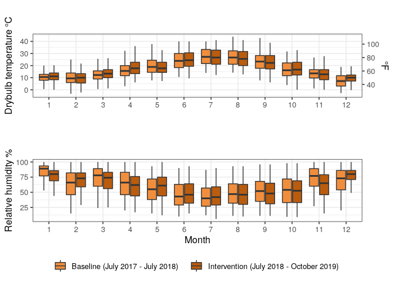

Example of standardizing, summarizing, and plotting NOAA LCD weather
data
================
Dana Miller

The examples below are exerpts from a scientific manuscript
demonstrating common data manipulation and visualization taaks using the
popular `tidyverse` and `ggplot2` packages in R. My goal is to provide
an accesible introduction to this workflow for users new to RMarkdown
documents, using publically avalible data. This is a simplified version
of relevant steps when processing, summarizing, and presenting data in a
research report or manuscript, demonstrated on one relatively small
dataset that is already in a ‘tidy’ format.

``` r
# Load required libraries
library(lubridate)  # note lubridate::here conflicts with here::here, specify namespace explicitly when used below
library(tidyverse)
library(here)       # package to manage relative file paths
library(skimr)
library(cowplot)    # package for additional plotting options
library(gt)
```

### About the data

### Load data

``` r
# Will use convention of `_cleaned` to designate data read in from `/cleaned_data`, but note that each dataset has 
# additional processing below, eg taking hourly averages, merging with metadata, aligning naming 
# conventions between datasets etc
weather_cleaned <- read_rds(here::here("cleaned_data/allWeather.rds"))
```

### Load helper functions

  - One helper function is included below. If there were much longer
    helper functions, they could be stored in a .R script in a dedicated
    subfolder (often named `/src` by convention) and called here.

<!-- end list -->

``` r
filter_hvac_failure <- function(input_df) {
  # Function to remove data from dates during mechanical system failure at one site
  # since this period is not representitive to compare to other data
  
  # Function input is a dataframe with columns 'datetime_utc_hourly' and 'site'
  
      site1_filtered <-  input_df %>%
                        filter(site == "Site1") %>% 
                        filter(datetime_utc_hourly < "2018-08-10" | datetime_utc_hourly > "2019-06-24")
      
      other_sites_filtered <-  input_df %>%
                              filter(site != "Site1") 
      
      compressors_field_study_filtered <- bind_rows(site1_filtered, other_sites_filtered) %>% 
                              arrange(datetime_utc_hourly)
      return(compressors_field_study_filtered)
    }
```

### Data standarization

#### Notes for conventions for all datasets (including weather data)

  - `_hourly` : version of dataset with hourly averages
  - `_info`: version of dataset with the following additional variables
    created:
      - intervention: ‘Baseline’ or ‘Intervention’ (based on dates of
        week fans started operating, in code below)
      - From zone\_metadata file
          - hvac\_zone\_display: eg C1, C2…R1-R6 (C = Commercial, R =
            Residential)
          - space\_occupancy\_type: Residential, Commercial - irregular
            occupancy, Commercial - regular occupancy
      - From transformations of existing data
          - month (numeric) - for functions that filter by month
          - month\_factor (factor) - for boxplots that need factor input
          - year (numeric) - for functions that filter by calender year
          - hour (numeric) - for functions that filter by hour of day (
            0 - 23)
          - hour\_factor(factor) - for boxplots that need factor input
      - Only for weather file
          - site\_display - To combine Site 3 + 4 as one factor for
            graphing since weather files are same (co-located sites)
  - The cleaned file, with the info above appended, will be called
    `*_info`
  - The file with info appended, and additionally summarized to hourly
    averages, will be named `*_hourly` (not `*_hourly_info`) for
    brevity, if it’s hourly the ‘info’ has alreadly been appended :)
  - Dataframes that have additionally been filtered to remove the HVAC
    failure period for data from Site 1 (ie dataframe has full
    timeperiod for site 2-4 data, and Site 1 data only putside of HVAC
    failure period) are labeled as ‘filtered’

#### Standardize weather data

##### Add metadata to cleaned data

``` r
# Append additional metadata info to cleaned weather data 
weather_info  <- weather_cleaned %>%
   filter(datetime_utc<"2019-10-31 00:00:00")%>%  # Filter for period during field study ie July 2017 - Oct 2020
   filter(datetime_utc>"2017-07-18 00:00:00")%>%  
    # select relevant columns
     select(datetime_utc, temperature_c, humidity_rh, wind_speed_mps, unique_datastream_id, site) %>% 
  mutate(intervention = case_when(   
    # Create new column reflecting intervention status at each field site at each timestamp              
                site == "Site1" & datetime_utc <= as_datetime("2018-07-06 00:00:00") ~ "Baseline",
                site == "Site2" & datetime_utc <= as_datetime("2018-07-13 00:00:00") ~ "Baseline",
                site == "Site3" & datetime_utc  <= as_datetime("2018-07-20 00:00:00") ~ "Baseline",
                site == "Site4" & datetime_utc <= as_datetime("2018-07-20 00:00:00") ~ "Baseline",   
                TRUE ~ "Intervention")) %>%  # Logic assumes that any periods that are not baseline are intervention  
   mutate(site_display = case_when(  
     # Create new column called 'site_display', since Sites 3 and 4 share the same weather file           
                site == "Site1" ~ "Site 1",
                site == "Site2" ~ "Site 2",           
                site == "Site3" ~ "Site 3 and 4",
                site == "Site4" ~ "Site 3 and 4")) %>%
  mutate(month_factor = as.factor(lubridate::month(datetime_utc)),  # Must be formatted as factor for plot formatting
         year_factor = as.factor(lubridate::year(datetime_utc)),
         hour_factor = as.factor(lubridate::year(datetime_utc))) %>%
  # Additional columsn below formatted as numeric for subsequent numeric-based filtering that can't take factors
  mutate(month = lubridate::month(datetime_utc),
         year = lubridate::year(datetime_utc),
         yday = lubridate::yday(datetime_utc),
         wday = lubridate::wday(datetime_utc),
         hour = lubridate::hour(datetime_utc)) 
```

##### Create hourly summary and add dew point, vapor pressure, and absolute humidity conversion

``` r
weather_hourly <- weather_info %>% 
     group_by(datetime_utc_hourly = floor_date(datetime_utc, "hour"), unique_datastream_id,  # Setting time interval 
              site, intervention, site_display, month_factor, year_factor, hour_factor,   
              month, year, hour, yday, wday) %>%                     # Selecting columns to track in grouping
    # summarize hourly temperature, humidity, and wind speed values
     mutate(temperature_c_hourly = mean(temperature_c, na.rm=TRUE),  
            humidity_rh_hourly = mean(humidity_rh, na.rm=TRUE),
            wind_speed_mps_hourly = mean(wind_speed_mps, na.rm=TRUE)) %>%
     ungroup() %>% 
  # select columns to keep 
     select(datetime_utc_hourly, unique_datastream_id, site, temperature_c_hourly, humidity_rh_hourly,   
         wind_speed_mps_hourly, intervention, site_display, month_factor, year_factor, hour_factor, 
         month, year, hour, yday, wday) %>% 
  distinct() %>%  # Only retain distinct columns 
                 # (ie drop any duplicate identical rows with same timestamp and same values)
   mutate(  # see notes below on data conversion
     dew_point_temperature_c_hourly = (243.12*(log(humidity_rh_hourly/100) +17.62*temperature_c_hourly/(243.12+temperature_c_hourly)))/(17.62-(log(humidity_rh_hourly/100) +17.62*temperature_c_hourly/(243.12+temperature_c_hourly))),
         vapour_p_hourly = 6.116441*10^(7.59138*temperature_c_hourly/(temperature_c_hourly+240.726)) * humidity_rh_hourly/100, # in hPa units
         humidity_ah_hourly = 2.16679 * (vapour_p_hourly*100)/(273.15+temperature_c_hourly)) # in g/m3 units
  
# Notes on estimating absolute humidity
# Based on reference from Sonja here: https://github.com/CenterForTheBuiltEnvironment/fans-field-tstats/blob/master/code/hamilton_rh_analysis.Rmd 
#approximation of dew point temperature if you know the observed temperature and relative humidity, The dew point is calculated according to the following formula:
#Ts = (b * α(T,RH)) / (a - α(T,RH))
#where:
#    Ts is the dew point;
#    T is the temperature;
#    RH is the relative humidity of the air;
#    a and b are coefficients. For Sonntag90 constant set, a=17.62 and b=243.12°C;
#    α(T,RH) = ln(RH/100) +a*T/(b+T).
  
# Subset weather data with equipment failure period at Site 1 removed  
weather_filtered <- filter_hvac_failure(weather_hourly)
```

##### Save standarized data frames

  - In a lengthy document, the output of the chunks above could be
    saved, and subsequent steps could start with re-loading the saved
    output files if the data standardization does not need to be re-run.

### Summarize data

  - In this example, we are interested in calculating summary variables
    for the warmest months of the year, namely April - October.
  - It is helpful to assign key results to descriptively-named variables
    (eg `baseline_cooling_period_mean_hourly_oat_c`) to directly these
    values in calculations or other outputs
later

#### Across all sites

``` r
# Calculate mean temperature and humdity during April - October, averaged across all sites, per period

##Temperature - overall averages across all sites
baseline_cooling_period_mean_hourly_oat_c <- weather_filtered %>%
                                     filter(month >= 4 & month<= 10) %>%
                                     filter(site != "Site4") %>%   # Avoid double counting values from Site 3 and 4 w/ same weather
                                     filter(intervention == "Baseline") %>%
                                     summarise(mean_hourly_temp_c = mean(temperature_c_hourly, na.rm = T))

intervention_cooling_period_mean_hourly_oat_c <- weather_filtered %>%
                                     filter(month >= 4 & month <= 10) %>%
                                      filter(site != "Site4") %>% 
                                     filter(intervention == "Intervention") %>%
                                     summarise(mean_hourly_temp_c = mean(temperature_c_hourly, na.rm = T))

mean_difference_hourly_oat_c <- round(intervention_cooling_period_mean_hourly_oat_c - baseline_cooling_period_mean_hourly_oat_c, 1)


## Relative humidity -  overall averages across all sites
baseline_cooling_period_mean_hourly_rh  <- weather_filtered %>%
                                     filter(month >= 4 & month<= 10) %>%
                                     filter(site != "Site4") %>%  
                                     filter(intervention == "Baseline") %>%
                                     summarise(mean_hourly_rh = mean(humidity_rh_hourly, na.rm = T))

intervention_cooling_period_mean_hourly_rh <- weather_filtered %>%
                                     filter(month >= 4 & month <= 10) %>%
                                      filter(site != "Site4") %>% 
                                     filter(intervention == "Intervention") %>%
                                      summarise(mean_hourly_rh = mean(humidity_rh_hourly, na.rm = T))

mean_difference_hourly_rh <- round(intervention_cooling_period_mean_hourly_rh  - baseline_cooling_period_mean_hourly_rh,2)
```

``` r
# Calculate range of mean daily high temperatures throughout entire field study duration
 mean_daily_high_temps <- weather_filtered %>%
  filter(month >= 4 & month<= 10) %>%
  filter(site != "Site4") %>% # avoid double counting
  group_by(yday, site) %>%
  summarise(max_daily_temp = max(temperature_c_hourly, na.rm = T),
          mean_daily_temp =mean(temperature_c_hourly, na.rm = T)) %>% 
  ungroup()

# Assign to variables for later use 
mean_daily_high_temps_c_min <-  min(mean_daily_high_temps$max_daily_temp)
mean_daily_high_temps_c_max <- max(mean_daily_high_temps$max_daily_temp)
```

#### Calculate mean values per site, and make a summary table

``` r
# Mean temperatures - each site separately
outdoor_temp_per_site_baseline <- weather_filtered %>%
                                  filter(month >= 4 & month<= 10) %>%
                                  filter(intervention == "Baseline") %>%
                                  group_by(site_display)%>%
                                  summarise(mean_hourly_temp_c_baseline = mean(temperature_c_hourly, na.rm = T)) 

outdoor_temp_per_site_intervention <- weather_filtered %>%
                                     filter(month >= 4 & month<= 10) %>%
                                     filter(intervention == "Intervention") %>%
                                     group_by(site_display)%>%
                                     summarise(mean_hourly_temp_c_intervention = mean(temperature_c_hourly, na.rm = T)) 

### Mean relative humidities - each site separately
outdoor_rh_per_site_baseline <- weather_filtered %>%
                                filter(month >= 4 & month <= 10) %>%
                                filter(intervention == "Baseline") %>%
                                group_by(site_display)%>%
                                summarise(mean_hourly_rh_baseline = mean(humidity_rh_hourly, na.rm = T)) 

outdoor_rh_per_site_intervention  <- weather_filtered %>%
                                     filter(month >= 4 & month <= 10) %>%
                                     filter(intervention == "Intervention") %>%
                                     group_by(site_display)%>%
                                     summarise(mean_hourly_rh_intervention = mean(humidity_rh_hourly, na.rm = T))

weather_df_for_table <- outdoor_temp_per_site_baseline %>% 
  left_join(outdoor_temp_per_site_intervention, by = "site_display") %>%
  mutate(delta_temp_c = mean_hourly_temp_c_intervention - mean_hourly_temp_c_baseline) %>%
  left_join(outdoor_rh_per_site_baseline, by = "site_display") %>%
  left_join(outdoor_rh_per_site_intervention, by = "site_display") %>%
  mutate(delta_rh_pct = mean_hourly_rh_intervention - mean_hourly_rh_baseline)
```

``` r
weather_summary_table <- weather_df_for_table %>%
  gt() %>%
  tab_header(
    title = "Outdoor environmental conditions per site",
    subtitle = "Hourly means during April - October cooling season"
    ) %>%
  tab_spanner(
    label = html("Air temperature [&deg;C]"),
    columns = vars(mean_hourly_temp_c_baseline, mean_hourly_temp_c_intervention, delta_temp_c)
    ) %>% 
   fmt_number(
    columns = vars(mean_hourly_temp_c_baseline, mean_hourly_temp_c_intervention, delta_temp_c),
    decimals = 1
  ) %>%
  tab_spanner(
    label = "Relative humidity [%]",
    columns = vars(mean_hourly_rh_baseline, mean_hourly_rh_intervention, delta_rh_pct)
    ) %>%  
   fmt_number(
    columns = vars(mean_hourly_rh_baseline, mean_hourly_rh_intervention, delta_rh_pct),
    decimals = 0
  ) %>%
  cols_label(
    site_display = html("Site"),
    mean_hourly_temp_c_baseline =  html("Baseline"),
    mean_hourly_temp_c_intervention = html("Intervention"),
    delta_temp_c = html("&Delta; T"),
    mean_hourly_rh_baseline = html("Baseline"),
    mean_hourly_rh_intervention = html("Intervention"),
    delta_rh_pct = html("&Delta; RH")
  ) %>%
  cols_align( align = "center")  %>%
  tab_source_note(
    source_note = html("Data from NOAA Local Climactic Data monitoring stations WBAN:23237 (Site 1), WBAN:23257 (Site 2), and WBAN:93242 (Sites 3 and 4)"))
```

<!--html_preserve-->

<style>html {
  font-family: -apple-system, BlinkMacSystemFont, 'Segoe UI', Roboto, Oxygen, Ubuntu, Cantarell, 'Helvetica Neue', 'Fira Sans', 'Droid Sans', Arial, sans-serif;
}

#zxfsnkmsuz .gt_table {
  display: table;
  border-collapse: collapse;
  margin-left: auto;
  margin-right: auto;
  color: #333333;
  font-size: 16px;
  background-color: #FFFFFF;
  width: auto;
  border-top-style: solid;
  border-top-width: 2px;
  border-top-color: #A8A8A8;
  border-right-style: none;
  border-right-width: 2px;
  border-right-color: #D3D3D3;
  border-bottom-style: solid;
  border-bottom-width: 2px;
  border-bottom-color: #A8A8A8;
  border-left-style: none;
  border-left-width: 2px;
  border-left-color: #D3D3D3;
}

#zxfsnkmsuz .gt_heading {
  background-color: #FFFFFF;
  text-align: center;
  border-bottom-color: #FFFFFF;
  border-left-style: none;
  border-left-width: 1px;
  border-left-color: #D3D3D3;
  border-right-style: none;
  border-right-width: 1px;
  border-right-color: #D3D3D3;
}

#zxfsnkmsuz .gt_title {
  color: #333333;
  font-size: 125%;
  font-weight: initial;
  padding-top: 4px;
  padding-bottom: 4px;
  border-bottom-color: #FFFFFF;
  border-bottom-width: 0;
}

#zxfsnkmsuz .gt_subtitle {
  color: #333333;
  font-size: 85%;
  font-weight: initial;
  padding-top: 0;
  padding-bottom: 4px;
  border-top-color: #FFFFFF;
  border-top-width: 0;
}

#zxfsnkmsuz .gt_bottom_border {
  border-bottom-style: solid;
  border-bottom-width: 2px;
  border-bottom-color: #D3D3D3;
}

#zxfsnkmsuz .gt_col_headings {
  border-top-style: solid;
  border-top-width: 2px;
  border-top-color: #D3D3D3;
  border-bottom-style: solid;
  border-bottom-width: 2px;
  border-bottom-color: #D3D3D3;
  border-left-style: none;
  border-left-width: 1px;
  border-left-color: #D3D3D3;
  border-right-style: none;
  border-right-width: 1px;
  border-right-color: #D3D3D3;
}

#zxfsnkmsuz .gt_col_heading {
  color: #333333;
  background-color: #FFFFFF;
  font-size: 100%;
  font-weight: normal;
  text-transform: inherit;
  border-left-style: none;
  border-left-width: 1px;
  border-left-color: #D3D3D3;
  border-right-style: none;
  border-right-width: 1px;
  border-right-color: #D3D3D3;
  vertical-align: bottom;
  padding-top: 5px;
  padding-bottom: 6px;
  padding-left: 5px;
  padding-right: 5px;
  overflow-x: hidden;
}

#zxfsnkmsuz .gt_column_spanner_outer {
  color: #333333;
  background-color: #FFFFFF;
  font-size: 100%;
  font-weight: normal;
  text-transform: inherit;
  padding-top: 0;
  padding-bottom: 0;
  padding-left: 4px;
  padding-right: 4px;
}

#zxfsnkmsuz .gt_column_spanner_outer:first-child {
  padding-left: 0;
}

#zxfsnkmsuz .gt_column_spanner_outer:last-child {
  padding-right: 0;
}

#zxfsnkmsuz .gt_column_spanner {
  border-bottom-style: solid;
  border-bottom-width: 2px;
  border-bottom-color: #D3D3D3;
  vertical-align: bottom;
  padding-top: 5px;
  padding-bottom: 6px;
  overflow-x: hidden;
  display: inline-block;
  width: 100%;
}

#zxfsnkmsuz .gt_group_heading {
  padding: 8px;
  color: #333333;
  background-color: #FFFFFF;
  font-size: 100%;
  font-weight: initial;
  text-transform: inherit;
  border-top-style: solid;
  border-top-width: 2px;
  border-top-color: #D3D3D3;
  border-bottom-style: solid;
  border-bottom-width: 2px;
  border-bottom-color: #D3D3D3;
  border-left-style: none;
  border-left-width: 1px;
  border-left-color: #D3D3D3;
  border-right-style: none;
  border-right-width: 1px;
  border-right-color: #D3D3D3;
  vertical-align: middle;
}

#zxfsnkmsuz .gt_empty_group_heading {
  padding: 0.5px;
  color: #333333;
  background-color: #FFFFFF;
  font-size: 100%;
  font-weight: initial;
  border-top-style: solid;
  border-top-width: 2px;
  border-top-color: #D3D3D3;
  border-bottom-style: solid;
  border-bottom-width: 2px;
  border-bottom-color: #D3D3D3;
  vertical-align: middle;
}

#zxfsnkmsuz .gt_striped {
  background-color: rgba(128, 128, 128, 0.05);
}

#zxfsnkmsuz .gt_from_md > :first-child {
  margin-top: 0;
}

#zxfsnkmsuz .gt_from_md > :last-child {
  margin-bottom: 0;
}

#zxfsnkmsuz .gt_row {
  padding-top: 8px;
  padding-bottom: 8px;
  padding-left: 5px;
  padding-right: 5px;
  margin: 10px;
  border-top-style: solid;
  border-top-width: 1px;
  border-top-color: #D3D3D3;
  border-left-style: none;
  border-left-width: 1px;
  border-left-color: #D3D3D3;
  border-right-style: none;
  border-right-width: 1px;
  border-right-color: #D3D3D3;
  vertical-align: middle;
  overflow-x: hidden;
}

#zxfsnkmsuz .gt_stub {
  color: #333333;
  background-color: #FFFFFF;
  font-size: 100%;
  font-weight: initial;
  text-transform: inherit;
  border-right-style: solid;
  border-right-width: 2px;
  border-right-color: #D3D3D3;
  padding-left: 12px;
}

#zxfsnkmsuz .gt_summary_row {
  color: #333333;
  background-color: #FFFFFF;
  text-transform: inherit;
  padding-top: 8px;
  padding-bottom: 8px;
  padding-left: 5px;
  padding-right: 5px;
}

#zxfsnkmsuz .gt_first_summary_row {
  padding-top: 8px;
  padding-bottom: 8px;
  padding-left: 5px;
  padding-right: 5px;
  border-top-style: solid;
  border-top-width: 2px;
  border-top-color: #D3D3D3;
}

#zxfsnkmsuz .gt_grand_summary_row {
  color: #333333;
  background-color: #FFFFFF;
  text-transform: inherit;
  padding-top: 8px;
  padding-bottom: 8px;
  padding-left: 5px;
  padding-right: 5px;
}

#zxfsnkmsuz .gt_first_grand_summary_row {
  padding-top: 8px;
  padding-bottom: 8px;
  padding-left: 5px;
  padding-right: 5px;
  border-top-style: double;
  border-top-width: 6px;
  border-top-color: #D3D3D3;
}

#zxfsnkmsuz .gt_table_body {
  border-top-style: solid;
  border-top-width: 2px;
  border-top-color: #D3D3D3;
  border-bottom-style: solid;
  border-bottom-width: 2px;
  border-bottom-color: #D3D3D3;
}

#zxfsnkmsuz .gt_footnotes {
  color: #333333;
  background-color: #FFFFFF;
  border-bottom-style: none;
  border-bottom-width: 2px;
  border-bottom-color: #D3D3D3;
  border-left-style: none;
  border-left-width: 2px;
  border-left-color: #D3D3D3;
  border-right-style: none;
  border-right-width: 2px;
  border-right-color: #D3D3D3;
}

#zxfsnkmsuz .gt_footnote {
  margin: 0px;
  font-size: 90%;
  padding: 4px;
}

#zxfsnkmsuz .gt_sourcenotes {
  color: #333333;
  background-color: #FFFFFF;
  border-bottom-style: none;
  border-bottom-width: 2px;
  border-bottom-color: #D3D3D3;
  border-left-style: none;
  border-left-width: 2px;
  border-left-color: #D3D3D3;
  border-right-style: none;
  border-right-width: 2px;
  border-right-color: #D3D3D3;
}

#zxfsnkmsuz .gt_sourcenote {
  font-size: 90%;
  padding: 4px;
}

#zxfsnkmsuz .gt_left {
  text-align: left;
}

#zxfsnkmsuz .gt_center {
  text-align: center;
}

#zxfsnkmsuz .gt_right {
  text-align: right;
  font-variant-numeric: tabular-nums;
}

#zxfsnkmsuz .gt_font_normal {
  font-weight: normal;
}

#zxfsnkmsuz .gt_font_bold {
  font-weight: bold;
}

#zxfsnkmsuz .gt_font_italic {
  font-style: italic;
}

#zxfsnkmsuz .gt_super {
  font-size: 65%;
}

#zxfsnkmsuz .gt_footnote_marks {
  font-style: italic;
  font-size: 65%;
}
</style>

<div id="zxfsnkmsuz" style="overflow-x:auto;overflow-y:auto;width:auto;height:auto;">

<table class="gt_table">

<thead class="gt_header">

<tr>

<th colspan="7" class="gt_heading gt_title gt_font_normal" style>

Outdoor environmental conditions per
site

</th>

</tr>

<tr>

<th colspan="7" class="gt_heading gt_subtitle gt_font_normal gt_bottom_border" style>

Hourly means during April - October cooling
season

</th>

</tr>

</thead>

<thead class="gt_col_headings">

<tr>

<th class="gt_col_heading gt_center gt_columns_bottom_border" rowspan="2" colspan="1">

Site

</th>

<th class="gt_center gt_columns_top_border gt_column_spanner_outer" rowspan="1" colspan="3">

<span class="gt_column_spanner">Air temperature
\[°C\]</span>

</th>

<th class="gt_center gt_columns_top_border gt_column_spanner_outer" rowspan="1" colspan="3">

<span class="gt_column_spanner">Relative humidity
\[%\]</span>

</th>

</tr>

<tr>

<th class="gt_col_heading gt_columns_bottom_border gt_center" rowspan="1" colspan="1">

Baseline

</th>

<th class="gt_col_heading gt_columns_bottom_border gt_center" rowspan="1" colspan="1">

Intervention

</th>

<th class="gt_col_heading gt_columns_bottom_border gt_center" rowspan="1" colspan="1">

Δ
T

</th>

<th class="gt_col_heading gt_columns_bottom_border gt_center" rowspan="1" colspan="1">

Baseline

</th>

<th class="gt_col_heading gt_columns_bottom_border gt_center" rowspan="1" colspan="1">

Intervention

</th>

<th class="gt_col_heading gt_columns_bottom_border gt_center" rowspan="1" colspan="1">

Δ RH

</th>

</tr>

</thead>

<tbody class="gt_table_body">

<tr>

<td class="gt_row gt_center">

Site 1

</td>

<td class="gt_row gt_center">

21.3

</td>

<td class="gt_row gt_center">

23.9

</td>

<td class="gt_row gt_center">

2.6

</td>

<td class="gt_row gt_center">

53

</td>

<td class="gt_row gt_center">

44

</td>

<td class="gt_row gt_center">

−9

</td>

</tr>

<tr>

<td class="gt_row gt_center">

Site 2

</td>

<td class="gt_row gt_center">

21.8

</td>

<td class="gt_row gt_center">

22.0

</td>

<td class="gt_row gt_center">

0.2

</td>

<td class="gt_row gt_center">

50

</td>

<td class="gt_row gt_center">

52

</td>

<td class="gt_row gt_center">

2

</td>

</tr>

<tr>

<td class="gt_row gt_center">

Site 3 and 4

</td>

<td class="gt_row gt_center">

22.4

</td>

<td class="gt_row gt_center">

22.7

</td>

<td class="gt_row gt_center">

0.2

</td>

<td class="gt_row gt_center">

52

</td>

<td class="gt_row gt_center">

50

</td>

<td class="gt_row gt_center">

−2

</td>

</tr>

</tbody>

<tfoot class="gt_sourcenotes">

<tr>

<td class="gt_sourcenote" colspan="7">

Data from NOAA Local Climactic Data monitoring stations WBAN:23237 (Site
1), WBAN:23257 (Site 2), and WBAN:93242 (Sites 3 and
4)

</td>

</tr>

</tfoot>

</table>

</div>

<!--/html_preserve-->

### Plot data

``` r
# Draw plots - first temperature, then humdity, and combine both panels with cowplot
temp_plot <- weather_filtered %>%
              ggplot(aes(month_factor, temperature_c_hourly,
                         fill = intervention,
                         group(interaction(intervention, month)))) + 
              geom_boxplot(show.legend = F, outlier.shape = NA) +
              scale_y_continuous(sec.axis = sec_axis(~ . * 1.8 + 32, name = "°F"))+ #turning to Fahrenheit
              #facet_wrap(.~site_display, ncol = 1, nrow = 3) +
  labs(title = "",
       subtitle = "",
         x = "",
         y = "Drybulb temperature °C") +
          theme_bw(base_size = 12) +
  scale_fill_manual(values=c("Baseline"="#F18E3D","Intervention"="#BA5C0E"), labels= c("Baseline", "Intervention"))

rh_humidity_plot <- weather_filtered %>%
              ggplot(aes(month_factor, humidity_rh_hourly,
                         fill = intervention,
                         group(interaction(intervention, month)))) + 
              geom_boxplot(outlier.shape = NA) +
              #facet_wrap(.~site_display, ncol = 1, nrow = 3) +
  labs(title = "",
       subtitle = "",
         x = "Month") +
         ylab("Relative humidity %") +
         theme_bw(base_size = 12) +
  scale_fill_manual(values=c("Baseline"="#F18E3D","Intervention"="#BA5C0E"), 
                    labels= c("Baseline (July 2017 - July 2018)", "Intervention (July 2018 - October 2019)")) +
  theme(legend.position="bottom", legend.title = element_blank()) + guides(color=guide_legend(""))
  
weather_plot <- cowplot::plot_grid(temp_plot, rh_humidity_plot, nrow=2, ncol=1, 
                                   #labels = c('a', 'b'),
                                   align = "v", 
                                   rel_widths = c(1, 1),
                                   rel_heights = c(1, 1.25))

# save results
ggsave("weather_plot.png", plot = weather_plot, 
       path= here("results"),
       dpi = 300, 
       width = 5.5,
       height = 4.25,
       units = "in"
)
```

<!-- -->
