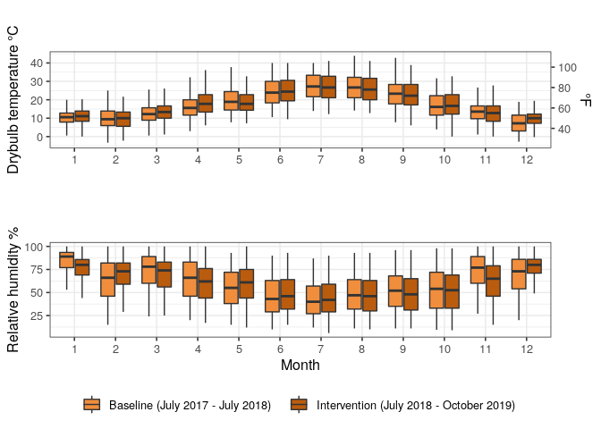

Example of standardizing, summarizing, and plotting NOAA LCD weather
data
================
Dana Miller

The examples below are exerpts from a scientific manuscript
demonstrating common data manipulation and visualization taaks using the
popular `tidyverse` and `ggplot2` packages in R. My goal is to provide
an accesible introduction to this workflow for users new to RMarkdown
documents, using publically avalible data. This is a simplified version
of relevant steps when processing, summarizing, and presenting data in a
research report or manuscript, demonstrated on one relatively small
dataset.

``` r
# Load required libraries
require(lubridate)  # note lubridate::here conflicts with here::here, specify namespace explicitly when used below
require(tidyverse)
require(here)       # package to manage relative file paths
require(skimr)
require(cowplot)    # package for additional plotting options

# Skimr options - turn off histograms to allow file to knit to markdown
skim_with(numeric = list(hist = NULL))
```

    ## function (data, ...) 
    ## {
    ##     data_name <- rlang::expr_label(substitute(data))
    ##     if (!is.data.frame(data)) {
    ##         data <- as.data.frame(data)
    ##     }
    ##     stopifnot(is.data.frame(data))
    ##     .vars <- rlang::quos(...)
    ##     cols <- names(data)
    ##     if (length(.vars) == 0) {
    ##         selected <- cols
    ##     }
    ##     else {
    ##         selected <- tidyselect::vars_select(cols, !!!.vars)
    ##     }
    ##     grps <- dplyr::groups(data)
    ##     if (length(grps) > 0) {
    ##         group_variables <- selected %in% as.character(grps)
    ##         selected <- selected[!group_variables]
    ##     }
    ##     skimmers <- purrr::map(selected, get_final_skimmers, data, 
    ##         local_skimmers, append)
    ##     types <- purrr::map_chr(skimmers, "skim_type")
    ##     unique_skimmers <- reduce_skimmers(skimmers, types)
    ##     combined_skimmers <- purrr::map(unique_skimmers, join_with_base, 
    ##         base)
    ##     ready_to_skim <- tibble::tibble(skim_type = unique(types), 
    ##         skimmers = purrr::map(combined_skimmers, mangle_names, 
    ##             names(base$funs)), skim_variable = split(selected, 
    ##             types)[unique(types)])
    ##     grouped <- dplyr::group_by(ready_to_skim, .data$skim_type)
    ##     nested <- dplyr::summarize(grouped, skimmed = purrr::map2(.data$skimmers, 
    ##         .data$skim_variable, skim_by_type, data))
    ##     structure(tidyr::unnest(nested, .data$skimmed), class = c("skim_df", 
    ##         "tbl_df", "tbl", "data.frame"), data_rows = nrow(data), 
    ##         data_cols = ncol(data), df_name = data_name, groups = dplyr::groups(data), 
    ##         base_skimmers = names(base$funs), skimmers_used = get_skimmers_used(unique_skimmers))
    ## }
    ## <bytecode: 0x55f8c0452df0>
    ## <environment: 0x55f8c0459020>

### About the data

### Load data

``` r
## Will use convention of `_cleaned` to designate data from `/cleaned_data`, but note that each dataset has substantial additional processing below, eg taking hourly averages, merging with metadata, aligning naming conventions between datasets etc
weather_cleaned <- read_rds(here::here("cleaned_data/allWeather.rds"))
```

### Load helper functions

``` r
# Function to remove data from dates during mechanical system failure at one site (unrepresentitive performance data)
filter_hvac_failure <- function(input_df) {
      site1_filtered <-  input_df %>%
                        filter(site == "Site1") %>% 
                        filter(datetime_utc_hourly < "2018-08-10" | datetime_utc_hourly > "2019-06-24")
      
      other_sites_filtered <-  input_df %>%
                              filter(site != "Site1") 
      
      compressors_field_study_filtered <- bind_rows(site1_filtered, other_sites_filtered) %>% 
                              arrange(datetime_utc_hourly)
      return(compressors_field_study_filtered )
    }
```

### Data standarization

#### Notes for all datasets

**Conventions as follows:**

  - `_hourly` : version of dataset with hourly averages
  - `_info`: version of dataset with the following variables created:
      - intervention: ‘Baseline’ or ‘Intervention’ (based on dates of
        week fans started operating, in code below)
      - From zone\_metadata file
          - hvac\_zone\_display: eg C1, C2…R1-R6 (C = Commercial, R =
            Residential)
          - space\_occupancy\_type: Residential, Commercial - irregular
            occupancy, Commercial - regular occupancy
      - From transformations of existing data
          - month (numeric) - for functions that filter by month
          - month\_factor (factor) - for boxplots that need factor input
          - year (numeric) - for functions that filter by calender year
          - hour (numeric) - for functions that filter by hour of day (
            0 - 23)
          - hour\_factor(factor) - for boxplots that need factor input
      - Only for weather file
          - site\_display - To combine Site 3 + 4 as one factor for
            graphing since weather files are same (co-located sites)
  - The cleaned file, with the info above appended, will be called
    `*_info`
  - The file with info appended, and additionally summarized to hourly
    averages, will be named `*_hourly` (not `*_hourly_info`) for
    brevity, if it’s hourly the ‘info’ has alreadly been appended :)
  - Dataframes that have additionally been filtered to remove the HVAC
    failure period for data from Site 1 (ie dataframe has full
    timeperiod for site 2-4 data, and Site 1 data only putside of HVAC
    failure period) are labeled as ‘filtered’

<!-- end list -->

``` r
# Standarization for each dataset below,
# Note currently only the *hourly* weather file, below, has the RH converted into absolute humdity

# Append additional metadata info to cleaned weather data 
weather_info  <- weather_cleaned %>%
   filter(datetime_utc<"2019-10-31 00:00:00")%>%  # Filter for period during field study ie July 2017 - Oct 2020
   filter(datetime_utc>"2017-07-18 00:00:00")%>%  
     select(datetime_utc, temperature_c, humidity_rh, wind_speed_mps, unique_datastream_id, site) %>% # relevant variables
  mutate(intervention = case_when(   # Create new column reflecting intervention status at each field site at each timestamp              
                site == "Site1" & datetime_utc <= as_datetime("2018-07-06 00:00:00") ~ "Baseline",
                site == "Site2" & datetime_utc <= as_datetime("2018-07-13 00:00:00") ~ "Baseline",
                site == "Site3" & datetime_utc  <= as_datetime("2018-07-20 00:00:00") ~ "Baseline",
                site == "Site4" & datetime_utc <= as_datetime("2018-07-20 00:00:00") ~ "Baseline",   
                TRUE ~ "Intervention")) %>%  # Logic assumes that any periods that are not baseline are intervention  
   mutate(site_display = case_when(  # Create new variable called 'site_display', since Sites 3 and 4 share the same weather file           
                site == "Site1" ~ "Site 1",
                site == "Site2" ~ "Site 2",           
                site == "Site3" ~ "Site 3 and 4",
                site == "Site4" ~ "Site 3 and 4")) %>%
  mutate(month_factor = as.factor(lubridate::month(datetime_utc)),  # Must be formatted as factor for plot formatting
         year_factor = as.factor(lubridate::year(datetime_utc)),
         hour_factor = as.factor(lubridate::year(datetime_utc))) %>%
  mutate(month = lubridate::month(datetime_utc), # Formatted as numeric for subsequent numeric-based filtering that can't take factors
         year = lubridate::year(datetime_utc),
         yday = lubridate::yday(datetime_utc),
         wday = lubridate::wday(datetime_utc),
         hour = lubridate::hour(datetime_utc)) 

# Take hourly average and add dew point, vapor pressure, and absolute humidity conversion
weather_hourly <- weather_info %>% 
     group_by(datetime_utc_hourly = floor_date(datetime_utc, "hour"), unique_datastream_id,   # Setting time interval 
              site, intervention, site_display, month_factor, year_factor, hour_factor,       # And selecting columns to track in grouping
              month, year, hour, yday, wday) %>%
     mutate(temperature_c_hourly = mean(temperature_c, na.rm=TRUE),  # summarize hourly temperature, humidity, and wind speed values
            humidity_rh_hourly = mean(humidity_rh, na.rm=TRUE),
            wind_speed_mps_hourly = mean(wind_speed_mps, na.rm=TRUE)) %>%
     ungroup() %>% 
  select(datetime_utc_hourly, unique_datastream_id, site, temperature_c_hourly, humidity_rh_hourly,   # select columns to keep 
         wind_speed_mps_hourly, intervention, site_display, month_factor, year_factor, hour_factor, month, year, hour, yday, wday) %>% 
  distinct() %>%  # Only retain distinct columns (ie drop any duplicate identical rows with same timestamp and same values)
   mutate(  # see notes below on conversion
     dew_point_temperature_c_hourly = (243.12*(log(humidity_rh_hourly/100) +17.62*temperature_c_hourly/(243.12+temperature_c_hourly)))/(17.62-(log(humidity_rh_hourly/100) +17.62*temperature_c_hourly/(243.12+temperature_c_hourly))),
         vapour_p_hourly = 6.116441*10^(7.59138*temperature_c_hourly/(temperature_c_hourly+240.726)) * humidity_rh_hourly/100, # in hPa units
         humidity_ah_hourly = 2.16679 * (vapour_p_hourly*100)/(273.15+temperature_c_hourly)) # in g/m3 units
  
# Notes on estimating absolute humidity
# Based on from Sonja here: https://github.com/CenterForTheBuiltEnvironment/fans-field-tstats/blob/master/code/hamilton_rh_analysis.Rmd 
#approximation of dew point temperature if you know the observed temperature and relative humidity, The dew point is calculated according to the following formula:
#Ts = (b * α(T,RH)) / (a - α(T,RH))
#where:
#    Ts is the dew point;
#    T is the temperature;
#    RH is the relative humidity of the air;
#    a and b are coefficients. For Sonntag90 constant set, a=17.62 and b=243.12°C;
#    α(T,RH) = ln(RH/100) +a*T/(b+T).
  
# Subset weather data with equipment failure period at Site 1 removed  
weather_filtered <- filter_hvac_failure(weather_hourly)
```

### Summarize data

``` r
# Calculate weather summary variables during April - October, averaged across all sites

##Temperature - overall average
baseline_cooling_period_mean_hourly_oat_c <- weather_filtered %>%
                                     filter(month >= 4 & month<= 10) %>%
                                     filter(site != "Site4") %>%   # Avoid double counting values from Site 3 and 4 w/ same weather
                                     filter(intervention == "Baseline") %>%
                                     summarise(mean_hourly_temp_c = mean(temperature_c_hourly, na.rm = T))

intervention_cooling_period_mean_hourly_oat_c <- weather_filtered %>%
                                     filter(month >= 4 & month <= 10) %>%
                                      filter(site != "Site4") %>%  # Avoid double counting values from Site 3 and 4 w/ same weather
                                     filter(intervention == "Intervention") %>%
                                     summarise(mean_hourly_temp_c = mean(temperature_c_hourly, na.rm = T))

mean_difference_hourly_oat_c <- round(intervention_cooling_period_mean_hourly_oat_c - baseline_cooling_period_mean_hourly_oat_c, 1)


##Humidity
# Relative - overall
baseline_cooling_period_mean_hourly_rh  <- weather_filtered %>%
                                     filter(month >= 4 & month<= 10) %>%
                                     filter(site != "Site4") %>%  # Avoid double counting values from Site 3 and 4 w/ same weather
                                     filter(intervention == "Baseline") %>%
                                     summarise(mean_hourly_rh = mean(humidity_rh_hourly, na.rm = T))

intervention_cooling_period_mean_hourly_rh <- weather_filtered %>%
                                     filter(month >= 4 & month <= 10) %>%
                                      filter(site != "Site4") %>%  # Avoid double counting values from Site 3 and 4 w/ same weather
                                     filter(intervention == "Intervention") %>%
                                      summarise(mean_hourly_rh = mean(humidity_rh_hourly, na.rm = T))

mean_difference_hourly_rh <- round(intervention_cooling_period_mean_hourly_rh  - baseline_cooling_period_mean_hourly_rh,2)
```

``` r
 mean_daily_high_temps <- weather_filtered %>%
  filter(month >= 4 & month<= 10) %>%
  filter(site != "Site4") %>% # avoid double counting
  group_by(yday, site) %>%
  summarise(max_daily_temp = max(temperature_c_hourly, na.rm = T),
          mean_daily_temp =mean(temperature_c_hourly, na.rm = T)) %>% 
  ungroup()
 
mean_daily_high_temps_c_min <-  min(mean_daily_high_temps$max_daily_temp)
mean_daily_high_temps_c_max <- max(mean_daily_high_temps$max_daily_temp)
```

``` r
# Temperature - each site separately
outdoor_temp_per_site_baseline <- weather_filtered %>%
                                  filter(month >= 4 & month<= 10) %>%
                                  filter(intervention == "Baseline") %>%
                                  group_by(site_display)%>%
                                  summarise(mean_hourly_temp_c_baseline = mean(temperature_c_hourly, na.rm = T)) 

outdoor_temp_per_site_intervention <- weather_filtered %>%
                                     filter(month >= 4 & month<= 10) %>%
                                     filter(intervention == "Intervention") %>%
                                     group_by(site_display)%>%
                                     summarise(mean_hourly_temp_c_intervention = mean(temperature_c_hourly, na.rm = T)) 

### Relative - each site separately
outdoor_rh_per_site_baseline <- weather_filtered %>%
                                     filter(month >= 4 & month <= 10) %>%
                                     filter(intervention == "Baseline") %>%
                                     group_by(site_display)%>%
                                     summarise(mean_hourly_rh_baseline = mean(humidity_rh_hourly, na.rm = T)) 

outdoor_rh_per_site_intervention  <- weather_filtered %>%
                                     filter(month >= 4 & month <= 10) %>%
                                     filter(intervention == "Intervention") %>%
                                     group_by(site_display)%>%
                                     summarise(mean_hourly_rh_intervention = mean(humidity_rh_hourly, na.rm = T))

weather_df_for_table <- outdoor_temp_per_site_baseline %>% 
  left_join(outdoor_temp_per_site_intervention, by = "site_display") %>%
  mutate(delta_temp_c = mean_hourly_temp_c_intervention - mean_hourly_temp_c_baseline) %>%
  left_join(outdoor_rh_per_site_baseline, by = "site_display") %>%
  left_join(outdoor_rh_per_site_intervention, by = "site_display") %>%
  mutate(delta_rh_pct = mean_hourly_rh_intervention - mean_hourly_rh_baseline)
```

``` r
# Format weather summary table
```

``` r
# Draw plots
temp_plot <- weather_filtered %>%
              ggplot(aes(month_factor, temperature_c_hourly,
                         fill = intervention,
                         group(interaction(intervention, month)))) + 
              geom_boxplot(show.legend = F, outlier.shape = NA) +
              scale_y_continuous(sec.axis = sec_axis(~ . * 1.8 + 32, name = "°F"))+ #turning to Fahrenheit
              #facet_wrap(.~site_display, ncol = 1, nrow = 3) +
  labs(title = "",
       subtitle = "",
         x = "",
         y = "Drybulb temperature °C") +
          theme_bw(base_size = 12) +
  scale_fill_manual(values=c("Baseline"="#F18E3D","Intervention"="#BA5C0E"), labels= c("Baseline", "Intervention"))
rh_humidity_plot <- weather_filtered %>%
              ggplot(aes(month_factor, humidity_rh_hourly,
                         fill = intervention,
                         group(interaction(intervention, month)))) + 
              geom_boxplot(outlier.shape = NA) +
              #facet_wrap(.~site_display, ncol = 1, nrow = 3) +
  labs(title = "",
       subtitle = "",
         x = "Month") +
         ylab("Relative humidity %") +
         theme_bw(base_size = 12) +
  scale_fill_manual(values=c("Baseline"="#F18E3D","Intervention"="#BA5C0E"), 
                    labels= c("Baseline (July 2017 - July 2018)", "Intervention (July 2018 - October 2019)")) +
  theme(legend.position="bottom", legend.title = element_blank()) + guides(color=guide_legend(""))
  
weather_plot <- cowplot::plot_grid(temp_plot, rh_humidity_plot, nrow=2, ncol=1, 
                                   #labels = c('a', 'b'),
                                   align = "v", 
                                   rel_widths = c(1, 1),
                                   rel_heights = c(1, 1.25))
ggsave("weather_plot.png", plot = weather_plot, 
       path= here("results"),
       dpi = 300, 
       width = 5.5,
       height = 4.25,
       units = "in"
)
```

``` r
weather_plot
```

<!-- -->
